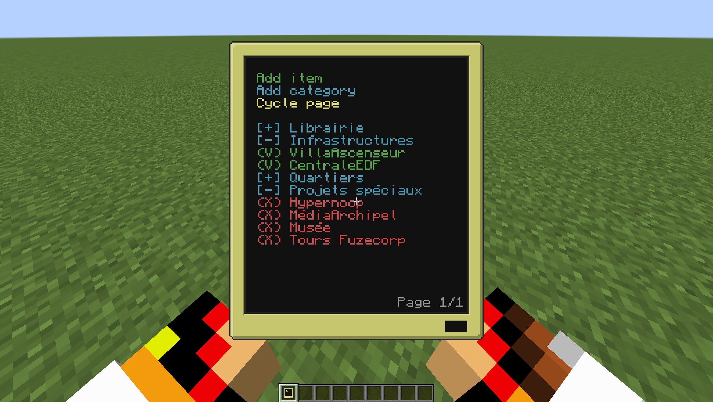

# 📋 TODO List Manager for ComputerCraft (CraftOS 1.8)

This is a simple but powerful **Todo List Manager** designed for **ComputerCraft** computers under **CraftOS 1.8**.  
It allows you to easily add, mark, copy, and paste tasks using a clean graphical interface, **without needing a monitor** — just your computer screen!

---

## ✨ Features

- ✅ Add new todo items directly.
- ✅ Mark items as **Done (❌)** or **Not Done (✔️)** by clicking.
- ✅ Display items with a **(V)** when active and **(X)** when done.
- ✅ Copy and paste items quickly.
- ✅ Automatically saves your todo list to a file.
- ✅ Displays **current page** and **total pages** at the bottom right.
- ✅ Fully compatible with CraftOS 1.8.

---

## 📜 Requirements

- A working **ComputerCraft** installation.
- **No external monitor needed** — everything happens directly on the computer screen.

---

## 📚 How to Use

1. Place the script (e.g. `clipboard.lua`) inside your computer.
2. Run it with:

   ```clipboard.lua```
3. Controls:

Click "Add item" to create a new task.

Click "Cycle page" to move to the next page.

Click on a task to toggle between done (❌) and not done (✔️).

Click "Copy item" to copy the first task, and "Paste item" to duplicate it.

## 📂 File Storage
- The todo list is automatically saved to a file called todolist in your computer's root directory.

- If the computer crashes or reboots, your tasks will be restored when you reopen the program.

## 🎨 Screenshot



Inspired by [somebody](https://pastebin.com/krRrrwBb)
